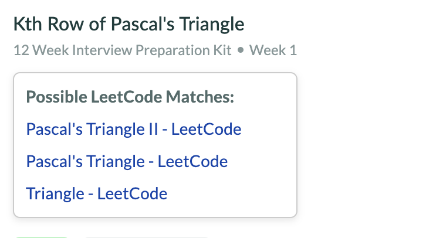

# 🔗 InterviewBit → LeetCode Extension

This Chrome Extension adds a **LeetCode redirect/search button** next to every InterviewBit problem.  
If a direct mapping exists, it links directly to the LeetCode version. Otherwise, it fetches the **top 3 relevant LeetCode problems using Google Programmable Search**.

---

Preview

- Site -> [InterviewBit Site](https://www.interviewbit.com/problems/majority-element/?study_plan=study-plan-3-months&/)

- 

---

## 🚀 Features

- ✅ **Smart mapping** of InterviewBit → LeetCode questions  
- 🔍 **Fallback using Google Programmable Search** (top 3 results)  
  &nbsp;&nbsp;&nbsp;&nbsp;&nbsp;&nbsp;  
- 🎯 **Clean UI** with a LeetCode logo icon button  
- 📎 Works directly on **InterviewBit problem pages**

---

## 🛠️ Installation (Developer Mode)

1. **Clone or download** this repo  
2. Replace keys in `content.js`:
   ```js
   const GOOGLE_API_KEY = "your-api-key";
   const CSE_ID = "your-cse-id";

OR

Create a .env file and inject values using the inject.js script:

GOOGLE_API_KEY=your-google-api-key
CSE_ID=your-cse-id